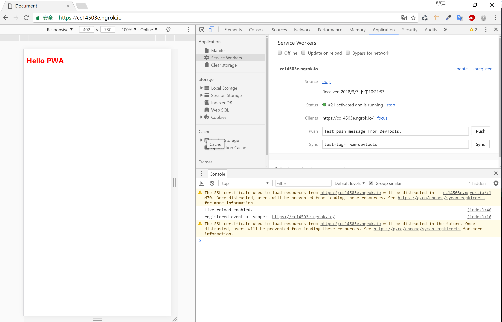

# PWA

> Progressive Web App, 简称 PWA，是提升 Web App 的体验的一种新方法，能给用户原生应用的体验。

PWA 能做到原生应用的体验不是靠特指某一项技术，而是经过应用一些新技术进行改进，在安全、性能和体验三个方面都有很大提升，PWA 本质上是 Web App，借助一些新技术也具备了 Native App 的一些特性，兼具 Web App 和 Native App 的优点。

PWA 的主要特点包括下面三点：
可靠 - 即使在不稳定的网络环境下，也能瞬间加载并展现
体验 - 快速响应，并且有平滑的动画响应用户的操作
粘性 - 像设备上的原生应用，具有沉浸式的用户体验，用户可以添加到桌面
PWA 本身强调渐进式，并不要求一次性达到安全、性能和体验上的所有要求，开发者可以通过 [PWA Checklist ](https://developers.google.cn/web/progressive-web-apps/checklist)查看现有的特征。
如何开始呢？一个 PWA 应用首先是一个网页, 可以通过 Web 技术编写出一个网页应用。随后添加上 App Manifest 和 Service Worker 来实现 PWA 的安装和离线等功能。
接下来，开始一个简单的教程。

## 准备

建议安装[live-server](https://www.npmjs.com/package/live-server) npm包和[ngrok](https://ngrok.com/download)神器;live-server用于修改代码，浏览器自动刷新；ngrok用于内网转发渗透，且支持HTTPS协议，对外网接入PWA可以提供HTTPS;好处不言而喻。

## 生命周期


From MDN

* 安装( installing )：这个状态发生在 Service Worker 注册之后，表示开始安装，触发 install 事件回调指定一些静态资源进行离线缓存。
install 事件回调中有两个方法：

1. event.waitUntil()：传入一个 Promise 为参数，等到该 Promise 为 resolve 状态为止。

2. self.skipWaiting()：self 是当前 context 的 global 变量，执行该方法表示强制当前处在 waiting 状态的 Service Worker 进入 activate 状态。

* 安装后( installed )：Service Worker 已经完成了安装，并且等待其他的 Service Worker 线程被关闭。

* 激活( activating )：在这个状态下没有被其他的 Service Worker 控制的客户端，允许当前的 worker 完成安装，并且清除了其他的 worker 以及关联缓存的旧缓存资源，等待新的 Service Worker 线程被激活。

activate 回调中有两个方法：

1. event.waitUntil()：传入一个 Promise 为参数，等到该 Promise 为 resolve 状态为止。

2. self.clients.claim()：在 activate 事件回调中执行该方法表示取得页面的控制权, 这样之后打开页面都会使用版本更新的缓存。旧的 Service Worker 脚本不再控制着页面，之后会被停止。

* 激活后( activated )：在这个状态会处理 activate 事件回调 (提供了更新缓存策略的机会)。并可以处理功能性的事件 fetch (请求)、sync (后台同步)、push (推送)。

* 废弃状态 ( redundant )：这个状态表示一个 Service Worker 的生命周期结束。


From MDN

* install：Service Worker 安装成功后被触发的事件，在事件处理函数中可以添加需要缓存的文件。

* activate：当 Service Worker 安装完成后并进入激活状态，会触发 activate 事件。通过监听 activate 事件你可以做一些预处理，如对旧版本的更新、对无用缓存的清理等。

* message：Service Worker 运行于独立 context 中，无法直接访问当前页面主线程的 DOM 等信息，但是通过 postMessage API，可以实现他们之间的消息传递，这样主线程就可以接受 Service Worker 的指令操作 DOM。

## Service Work变量

1. self: 表示 Service Worker 作用域, 也是全局变量
2. caches: 表示缓存
3. skipWaiting: 表示强制当前处在 waiting 状态的脚本进入 activate 状态
4. clients: 表示 Service Worker 接管的页面

建立PWA工程、简单的Html页、 css 及 manifest.json ，并将 manifest.json通过如下代码引入hmtl。

```html
<link rel="manifest" href="./manifest.json" />
```

index.html

```html
<!DOCTYPE html>
<html lang="en">
<head>
    <meta charset="UTF-8">
    <meta name="viewport" content="width=device-width, initial-scale=1.0">
    <meta http-equiv="X-UA-Compatible" content="ie=edge">
    <link rel="stylesheet" href="./main.css">
    <link rel="manifest" href="./manifest.json">
    <title>Document</title>
</head>
<body>
    <h3>Hello PWA</h3>
</body>
</html>
```

manifest.json

```json
{
  "name": "My PWA",
  "short_name": "MyWA",
  "display": "standalone",
  "start_url": "/",
  "theme_color": "#88eeff",
  "background_color": "#ccaaff",
  "icons": [
    {
      "src": "e.png",
      "sizes": "256x256",
      "type": "image/png"
    }
  ]
}
```

main.css

```css
h3{
    color: #f00
}
```

## 添加 Service Worker

Service Worker 在网页已经关闭的情况下还可以运行, 用来实现页面的缓存和离线, 后台通知[notification API](https://developer.mozilla.org/zh-CN/docs/Web/API/notification)等等功能。

```js
if (navigator.serviceWorker != null) {
    navigator.serviceWorker.register('sw.js')
    .then(function(registration) {
      console.log('Registered events at scope: ', registration.scope);
    });
  }
```

## 定义要缓存的内容

在根目录新建sw.js文件，并写入如下内容。

```js
let cacheStorageKey = 'pwa-1'; // 用于更新SW
let cacheList = [ // 缓存文件列表
    "/",
    "./index.html",
    "./main.css",
    "./icon.png",
    "./manifest.json"
];
```

## 缓存资源

使用Service Work，在注册后完成安装Server Work时，进行资源获取和缓存。

```js
self.addEventListener("install", e=> {
    e.waitUntil(
        caches.open(cacheStorageKey) // 创建这个版本的缓存
        .then(cache=> cache.addAll(cacheList)) // 缓存资源
        .then(()=>self.skipWaiting()) // 为了在页面更新的过程当中, 新的 Service Worker 脚本能立即激活和生效。
    )
});
```

## 网络请求处理

在正式的网页中，可能伴随着从服务器端获取最新数据这样的业务；在Service Work 中是通过HTML5 fetch来拦截客户端请求的，如果本地缓存如 localStorage 或者 Cookie中有内容，则从其中获取，否则向服务器发送请求，将得到的数据返回页面并将其存储起来，供下次使用。

```js
self.addEventListener('fetch', function (event) {
    event.respondWith(
        caches.match(event.request).then(function (response) {
            // 在这代理可以搞一些代理的事情
            // 如果 Service Worker 有自己的返回，就直接返回，减少一次 http 请求
            if (response) {
                return response;
            }
            // 如果 service worker 没有返回，那就得直接请求真实远程服务
            var request = event.request.clone(); // 把原始请求拷过来
            return fetch(request).then(function (httpRes) {
                // http请求的返回已被抓到，可以处置了。
                // 请求失败了，直接返回失败的结果就好了。
                if (!httpRes || httpRes.status !== 200) {
                    return httpRes;
                }
                // 请求成功的话，将请求缓存起来。
                var responseClone = httpRes.clone();
                caches.open('my-test-cache-v1').then(function (cache) {
                    cache.put(event.request, responseClone);
                });
                return httpRes;
            });
        })
    );
});
```

## 更新资源

我们的PWA上线以后，肯定会进行更新，包括页面更新、数据更新等等的。那么怎么保证我们浏览器中的PWA程序和我们服务器上的程序是最新的呢？关键就在于最开始的 cacheStorageKey 。只要浏览器中的这个版本号和服务器端的版本号不一致，浏览器中的 Service Work 就会从服务器获取最新的，还有一点，浏览器中的 Service Work 每隔24小时自动会从服务器请求一次，从而保证本地的 PWA 是最新的，这也省去了用户更新的麻烦。

在什么时候更新呢，当然是PWA在激活状态时，直接上代码。

```js
self.addEventListener('activate', function(e) {
    e.waitUntil(
        // 清理旧版本
        caches.keys().then(cacheNames=> {
            return Promise.all(
                cacheNames.filter(cacheNames=> {
                    return cacheNames !== cacheStorageKey
                }).map(cacheNames=> {
                    // 清理过期的缓存文件
                    return caches.delete(cacheNames);
                })
            ).then(()=>{
                return self.clients.clain(); // 更新所有客户端上的 Service Worker
            })
        })
    );
});
```

如果要进行版本跟新，只需要更改cacheStorageKey的值与之前的值不一致即可。
在新安装的 Service Worker 中通过调用 self.clients.claim() 取得页面的控制权, 这样之后打开页面都会使用版本更新的缓存。旧的 Service Worker 脚本不再控制着页面之后会被停止。

### 启动应用

通过 CMD 或者 shell 进入项目根目录，执行如下代码，即可查看到网页，并且还可以用ngrok进行代理，用手机或者其他设备即可访问带有HTTPS协议的PWA了。

```shell
live-server --port=4000 ## 启动4000端口

# 启动另一个 CMD 窗口或者 shell 窗口
ngrok http 4000 ## 代理本地的4000端口，输出一下内容

ngrok by @inconshreveable                                                                              (Ctrl+C to quit)

Session Status                online
Session Expires               7 hours, 59 minutes
Version                       2.2.8
Region                        United States (us)
Web Interface                 http://127.0.0.1:4040
Forwarding                    http://cc14503e.ngrok.io -> localhost:4000
Forwarding                    https://cc14503e.ngrok.io -> localhost:4000

Connections                   ttl     opn     rt1     rt5     p50     p90
                              0       0       0.00    0.00    0.00    0.00
```

由此可以看到ngrok已经代理成功，我们可以打开如下带有https的地址进行访问。

```shell
Forwarding                    https://cc14503e.ngrok.io -> 
```

## 效果

